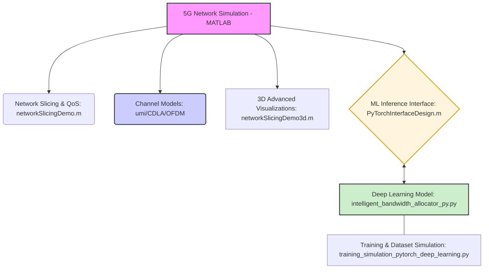

# ✨ Intelligent Per-Packet Resource Allocation in 5G Networks Using CNN-BiLSTM

This repository contains MATLAB and Python code for simulating and visualizing aspects of 5G network resource allocation and channel characteristics, focusing on intelligent bandwidth allocation using a CNN-BiLSTM deep learning model. It explores network slicing, channel modeling, and the deployment of machine learning for dynamic resource management.

---

## 🚀 Features

*   **5G Network Slicing Simulation**: MATLAB scripts to define and visualize different 5G network slices (eMBB, URLLC, mMTC) with their respective QoS parameters and bandwidth allocation.
*   **Dynamic Bandwidth Allocation (MATLAB)**: Real-time simulation of application-specific bandwidth allocation using a mock ML inference engine, capable of integrating with ONNX models.
*   **CNN-BiLSTM for Packet Classification**: A PyTorch-based deep learning model designed for intelligent per-packet classification, predicting optimal resource allocation based on packet features.
*   **5G Channel Modeling**: MATLAB scripts to simulate and visualize 5G channel characteristics including UMi path loss, CDL-A channel impulse responses, and OFDM frame structures.
*   **Deep Learning Training & Evaluation**: PyTorch code for training the CNN-BiLSTM model, including dataset simulation and visualization of training progress.
*   **Publication-Quality Visualizations**: Advanced MATLAB functions for generating IEEE-standard figures with enhanced aesthetics, lighting, and 3D representations.

## 🏗️ Architecture

The project leverages both MATLAB for network simulation and channel modeling, and Python (PyTorch) for the machine learning core. MATLAB provides a good environment for rapid prototyping and visualization of communication system concepts, while PyTorch is used for developing and training the deep learning model. The `PyTorchInterfaceDesign.m` file acts as a bridge, demonstrating how a MATLAB simulation could interact with an ONNX-exported PyTorch model for real-time inference.



## 🛠️ Tech Stack

*   **MATLAB**: Core environment for network simulations, channel modeling, and visualization.
*   **Python**: For developing and training the deep learning model.
*   **PyTorch**: Deep learning framework used for the CNN-BiLSTM model.
*   **NumPy**: Essential for numerical operations in Python.
*   **Matplotlib**: For plotting and visualization in Python.
*   **ONNX (Optional)**: Demonstrated as an interface for deploying trained PyTorch models to MATLAB for inference.

## 📁 Project Structure

```
.
├── CDLAChannelImpulseresponseandmultipathcharacteristics.m
├── PyTorchInterfaceDesign.m
├── fivegnrframestructureandofdmsymboltiming.m
├── intelligent_bandwidth_allocator_py.py
├── networkSlicingDemo.m
├── networkSlicingDemo3d.m
├── training_simulation_pytorch_deep_learning.py
└── umipathloss.m
```

## 🚀 Getting Started

To get started with this project, you will need both MATLAB and a Python environment with PyTorch installed.

### Prerequisites

*   **MATLAB**: R2020a or newer (with Deep Learning Toolbox for ONNX integration, though the `PyTorchInterfaceDesign.m` uses mock inference if ONNX runtime is not fully configured).
*   **Python 3.8+**:
    *   `pytorch`
    *   `numpy`
    *   `matplotlib`
    *   `onnxruntime` (if you intend to run the ONNX integration from MATLAB)

### Installation

For Python dependencies, create a virtual environment and install the required packages:

```bash
python -m venv venv
source venv/bin/activate # On Windows use `venv\Scripts\activate`
pip install torch numpy matplotlib onnxruntime
```

### Running MATLAB Simulations

To run the MATLAB simulations and visualizations:

1.  Open MATLAB.
2.  Navigate to the directory where you cloned this repository.
3.  Run the desired script from the MATLAB command window:

    *   **Network Slicing & Bandwidth Allocation**:
        ```matlab
        networkSlicingDemo
        ```
        ```matlab
        networkSlicingDemo3d
        ```
    *   **Channel Modeling**:
        ```matlab
        umipathloss
        ```
        ```matlab
        CDLAChannelImpulseresponseandmultipathcharacteristics
        ```
        ```matlab
        fivegnrframestructureandofdmsymboltiming
        ```
    *   **PyTorch Interface Demo**:
        ```matlab
        PyTorchInterfaceDesign
        ```
        *(Note: This script currently uses a mock ML inference. For actual ONNX integration, ensure `onnxruntime` is correctly installed and accessible by MATLAB's Python interpreter.)*

### Running Python Deep Learning Code

To train the CNN-BiLSTM model or test its inference:

1.  Activate your Python virtual environment (if you created one):
    ```bash
    source venv/bin/activate
    ```
2.  **Train the model**:
    ```bash
    python training_simulation_pytorch_deep_learning.py
    ```
    This script will simulate a dataset, train the model, and display loss curves and prediction distributions.
3.  **Test model inference**:
    ```bash
    python intelligent_bandwidth_allocator_py.py
    ```
    This script defines the model, generates dummy input, performs a forward pass, and prints the output probabilities.

## ⚙️ Configuration / Environment Variables

The MATLAB scripts primarily use in-script parameters for configuration (e.g., `cfgCarrier.SubcarrierSpacing`, `totalBW`, `fc`). These can be modified directly within the `.m` files.

For the Python deep learning models, training parameters like `num_epochs`, `batch_size`, `lr`, and model architecture parameters (`vocab_size`, `embed_dim`, `hidden_dim`, `num_classes`, `dropout`) are defined within `training_simulation_pytorch_deep_learning.py` and `intelligent_bandwidth_allocator_py.py`.

There are no external environment variables currently required for this project.

## 🤝 Contributing

Contributions are welcome! If you have suggestions for improvements, new features, or bug fixes, please feel free to:

1.  Fork the repository.
2.  Create a new branch (`git checkout -b feature/your-feature`).
3.  Make your changes.
4.  Commit your changes (`git commit -m 'Add new feature'`).
5.  Push to the branch (`git push origin feature/your-feature`).
6.  Open a Pull Request.
